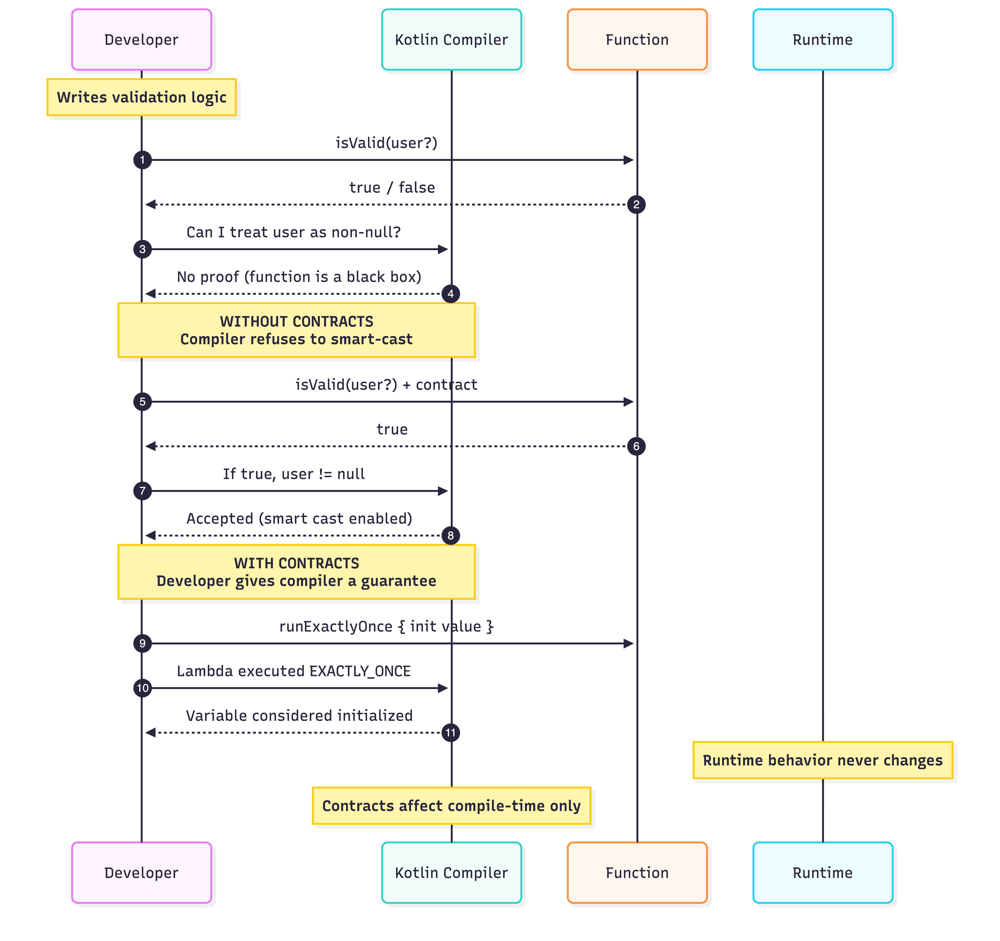

# Kotlin Contracts – Compiler-First Demonstration

This repository demonstrates **Kotlin Contracts** purely through **compiler behavior**.

There is no UI, no runtime output, and no executable feature flow.  
This is intentional.

Kotlin Contracts do not change runtime behavior.  
They only change what the **compiler is willing to trust**.

---

## Purpose of This Repository

This repo exists to show:

- why Kotlin does not smart-cast custom helpers by default
- how contracts allow you to express guarantees to the compiler
- how `callsInPlace` enables safe lambda-based initialization
- how compiler errors disappearing is the real “output” of contracts

If you are expecting logs, UI updates, or runtime differences, this repository is not meant for that.

---

## What Kotlin Contracts Are

Kotlin Contracts are **compile-time agreements** between the developer and the compiler.

They allow you to state:

- what a return value implies
- what a non-null result proves
- how many times a lambda is executed

They are:
- compile-time only
- trust-based
- explicit

They are not:
- runtime checks
- validation logic
- business rules
- safety mechanisms

---

## Project Structure

com.rishav.contracts
├── data
│ └── repository
│ └── UserRepository.kt
├── domain
│ ├── model
│ │ └── User.kt
│ └── contracts
│ ├── WithoutContracts.kt
│ ├── WithContracts.kt
│ └── LambdaContracts.kt
└── presentation
└── viewmodel
└── ContractExamplesViewModel.kt

The **ViewModel** is the primary demonstration surface.

---

## Where to Look

Open:

presentation/viewmodel/ContractExamplesViewModel.kt

This file contains:

- examples that intentionally fail compilation
- equivalent examples that compile due to contracts
- inline comments explaining compiler reasoning

You are expected to observe:
- red compiler errors
- green successful smart casts
- initialization being accepted or rejected

You are not expected to run anything.

---

## Kotlin Contract Types Demonstrated

### 1. `returns(value) implies condition`

Used to tell the compiler that a specific return value guarantees a condition.

Enables smart casts for custom validation helpers.

---

### 2. `returnsNotNull() implies condition`

Used when the existence of a non-null return value proves something about inputs.

Common in find, lookup, and builder-style APIs.

---

### 3. `callsInPlace(lambda, InvocationKind)`

Used to describe how many times a lambda is executed.

Demonstrates why:
- variable initialization inside lambdas normally fails
- `EXACTLY_ONCE` is required for safe initialization

Invocation kinds shown:
- EXACTLY_ONCE
- AT_LEAST_ONCE
- AT_MOST_ONCE
- UNKNOWN

---

## Intentional Compiler Errors

Some functions in this repository are **expected to fail compilation**.

These failures are deliberate and represent the problem Kotlin Contracts solve.

Fixing those errors removes the demonstration value.

---

## Why There Is No UI

Kotlin Contracts do not affect runtime behavior.

Adding UI or runtime output would:
- misrepresent what contracts do
- distract from compiler behavior
- weaken the educational purpose

This repository is a **compiler playground**, not an application.

---

## Key Takeaway

Kotlin Contracts are not about clever syntax.

They are about **communicating intent to the compiler**.

If you do not explicitly state your guarantees, the compiler will not assume them.

And it shouldn’t.